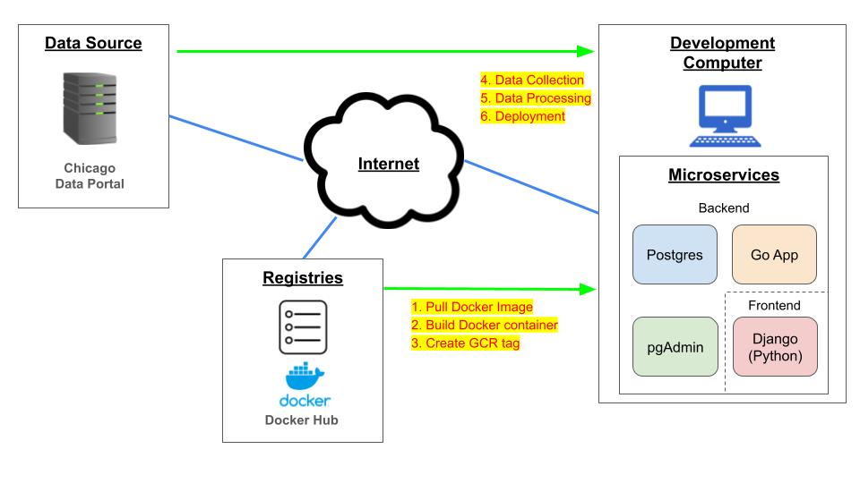

# Chicago Business Intelligence


Photo by <a href="https://unsplash.com/@sawyerbengtson?utm_content=creditCopyText&utm_medium=referral&utm_source=unsplash">Sawyer Bengtson</a>.

## Requirements
- Docker
- [Google Geocoding API](https://developers.google.com/maps/documentation/geocoding/get-api-key)
- GCP Account (For GCP Implementation)

## Table of Contents

1. [Introduction](#introduction)
    - [Data Source](#data-source)
    - [CI/CD](#cicd)

2. [Implementation](#implementation)
    - [Option 1: Local Implementation Network Diagram](#option-1-local-implementation-network-diagram)
    - [Option 2: GCP Implementation Network Diagram](#option-2-gcp-implementation-network-diagram)

3. [Settings](#settings)
    1. [Add Geocoder API Key](#1-add-google-geocoder-api-key)
    2. [Set Postgres Host Name](#2-set-postgres-host-name)
    3. [Set limit for API calls (Optional)](#3-set-limit-for-api-calls-optional)
    4. [Set Cloudbuild.yaml](#4-set-cloudbuildyaml-for-gcp-implementation)

4. [How to Start Code](#how-to-start-code)
    1. [Local Implementation](#1-local-implementation)
    2. [GCP Implementation](#2-gcp-implementation)

5. [Database Overview](#database-overview)

6. [Dashboards](#dashboards)

7. [Conclusion and future works](#conclusion-and-future-works)

- [Built with](#built-with)
- [Author](#author)

## Introduction
This project is a comprehensive data engineering endeavor aimed at providing a platform for data scientists to analyze various datasets sourced from the City of Chicago's [portal](https://data.cityofchicago.org/). The primary objective is to empower data scientists and business analysts with the necessary tools for exploratory data analysis and the creation of business intelligence reports. These reports will play a crucial role in strategic planning and decision-making processes regarding industrial and neighborhood infrastructure investments within the city of Chicago.

### Data Source
The data utilized in this project is sourced from the Chicago City portal's API. The datasets include but are not limited to:

- Taxi/Rideshare trips
- COVID-19 daily/weekly data
- Unemployment per neighborhood
- Building permits
- COVID-19 Community Vulnerability Index (CCVI)

The data is updated either daily, weekly, or monthly according to the update frequency of the source data.

### CI/CD
The CI/CD pipeline is set up to automate the deployment process using GCP. Upon pushing changes to the GitHub repository, the pipeline triggers the following actions:

- Updates Docker image.
- Pushes the updated Docker image to Google Container Registry (GCR).
- Deploys the microservice containers on GCP, ensuring the application is up to date.

## Implementation
This project is implemented locally using Docker for containerization and also leverages Google Cloud Platform (GCP) for deployment. Below is the network diagram for both local deployment using Docker and deployment on GCP.

### Option 1: Local Implementation Network Diagram


---

### Option 2: GCP Implementation Network Diagram


## Settings

The following steps are required to run this program.

### 1. Add Google Geocoder API Key
Add Google Geocoder API key in [`.env`](.env) file. To get an API key, follow the steps [here](https://developers.google.com/maps/documentation/geocoding/get-api-key).

`.env`
```
API_KEY=<YOUR API KEY>
```

### 2. Set Postgres Host Name
Add Postgres host name in [`.env`](.env) file.

`.env`
```
POSTGRES_HOST="host.docker.internal" # For local implementation

or

POSTGRES_HOST=<YOUR GCP HOST NAME> # For GCP implementation. (Eg. "/cloudsql/<your_project_id>:<your_region>:<your_sql_database>")
```

### 3. Set limit for API calls (Optional)
Set limit for API calls in [`.env`](.env) file.
This will set the limit for each API call for getting Taxi Trips, Daily/Weekly COVID data, and Building Permits data.

Default is set to 1000. If you want to specify no limits, change to `LIMIT=""`.

`.env`
```
LIMIT="<Set Limit>"
```

### 4. Set Cloudbuild.yaml (for GCP implementation)
[`cloudbuild.yaml`](cloudbuild.yaml) with corresponding GCP environments.

## How to Start Code
Before running the code, the [settings](#settings) must be completed.

### 1. Local Implementation
Build microservices container and start collecting data.

```
docker-compose up
```
Access [localhost:8000](http://localhost:8000) for the dasboard.

---

### 2. GCP Implementation
Follow instructions [here](GCP-setup-steps.pdf).

## Database Overview
After running this code, the application will create the following preprocessed tables:

| Table | Details | Updates |
|:---:|:---:|:---:|
| `building_permits` | Building Permits of Chicago | Daily |
| `ccvi_ca` | CCVI per community area | - |
| `ccvi_zip` | CCVI per zip code | - |
| `community_area_names` | Community area master table |  - |
| `covid_daily` | Daily COVID cases, deaths, and hospitalizations in Chicago  |  Weekly |
| `covid_weekly_zip` | Weekly COVID cases, tests, and deaths per zip code |  Weekly |
| `taxi_trips` | Taxi/Rideshare trips of Chicago |  Monthly |
| `unemployment` | Unemployment, poverty, and per capita income per community area |  - |
| `zip2ca` | Zip code to community area converter |  - |

For details of column data types, check [backend/sql/create_initial_tables.sql](backend/sql/create_initial_tables.sql).

## Dashboards
There are multiple sample dashboards for analysis. The list of dashboards are shown below. The URLs come after `<HOST_URL>/dashboard/`

| URL | Details |
|:---:|:---:|
| `taxis-from-airport/` | Taxi Trips From Airport |
| `high-ccvi-ca/` | Taxi Trips with High CCVI |
| `waive-building-fee/` | Building Fee Per Year |
| `new-construction-low-income/` | New Construction in Low Income Zip Codes Per Year |

- **Taxi Trips From Airport:** There are two major airports within the city of Chicago: O’Hare and Midway. This dashboard is to monitor the traffic of the taxi trips from these airports to the different neighborhoods and zip codes.
- **Taxi Trips with High CCVI:** The city of Chicago has created [CCVI](https://data.cityofchicago.org/Health-Human-Services/Chicago-COVID-19-Community-Vulnerability-Index-CCV/xhc6-88s9) metrics to identify communities that have been disproportionately affected by COVID-19 and are vulnerable to barriers to COVID-19 vaccine uptake. This dashboard is to track the number of taxi trips from/to the neighborhoods that have CCVI Category with value HIGH.
- **Building Fee Per Year:** This dashboard shows the total costs of building permits of the top 5 neighborhoods with either the highest unemployment or poverty rates.  The City of Chicago could potentially waive the fees for building permits in these neighborhoods in order to encourage businesses to develop and invest in these neighborhoods.
- **New Construction in Low Income Zip Codes Per Year:** According to a report published by [Crain’s Chicago Business](https://www.chicagobusiness.com/private-intelligence/chicago-area-industrial-real-estate-market-tight-smaller-companies), the “little guys”, small businesses, have trouble competing with the big players like Amazon and Walmart for warehouse spaces. This dashboard shows the new construction building permits in the zip code that have per capita income of less than $30,000 for the planned construction site. The City of Chicago can potentailly invest in these new construction sites to encourage small businesses to thrive.

## Conclusion and future works
This project demonstrates the integration of various technologies and methodologies in the field of data engineering to create a robust platform for data analysis and reporting. By leveraging Docker for containerization and GCP for deployment, the project ensures scalability, reliability, and ease of maintenance.

For future works, I want to add [Kubernetes](https://kubernetes.io/) to manage the micorservice containers and add engaging frontend designs such as [Streamlit](https://streamlit.io/).

## Built With
[Docker](https://www.docker.com/), [Go](https://go.dev/), [Python](https://www.python.org/), [PostgreSQL](https://www.postgresql.org/), [Django](https://www.djangoproject.com/)

## Author
* **Takeshi Sugiyama** - *Data Scientist*
  * [Linkedin](https://www.linkedin.com/in/takeshi-sugiyama/)
  * [Tableau](https://public.tableau.com/profile/takeshi.sugiyama)
